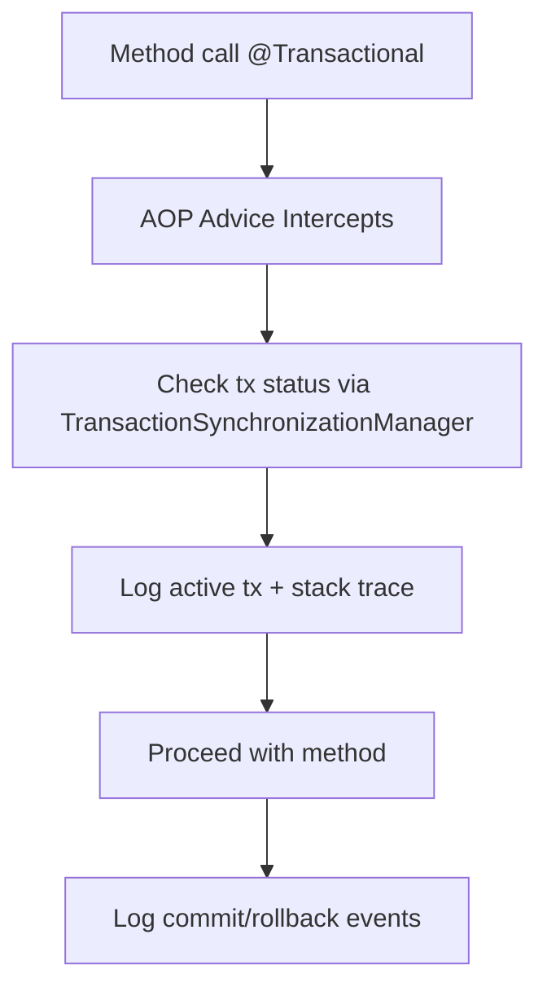

# 🧪 Spring Transaction Tracer Lab

A hands-on Maven project to explore **Spring Transactions, AOP logging, and EntityManager lifecycle**.

---

## 📘 Project Concept: Spring Transaction Tracer

### 🎯 Objectives
- Observe **how EntityManager and transactions are managed** (by you vs by Spring).  
- Track **transaction lifecycle events** (begin, commit, rollback).  
- Highlight **tricky gotchas** (self-invocation, propagation, nested vs new, read-only, rollback rules).  
- Provide a clear **logging/AOP layer** that records the call stack whenever transactional boundaries are crossed.  

---

## 🗺️ Core Features

### 1. Transaction Event Logging
- Use **AOP advice** around methods annotated with `@Transactional`.  
- Log:
  - Method signature  
  - Current thread  
  - Transaction propagation mode  
  - Whether a transaction is active  
  - Commit/rollback events  



### 2. EntityManager Tracing
- Custom `EntityManagerFactory`/`EntityManager` wrapper (or JPA proxy) to log when:
  - An `EntityManager` is requested (`createEntityManager`)  
  - It joins a transaction  
  - It flushes  
  - It closes  

### 3. Scenarios to Implement
- **Spring-managed transactions**
  - `@Transactional` with default propagation (REQUIRED).  
  - `@Transactional(propagation = REQUIRES_NEW)` inside another method.  
  - `@Transactional(readOnly = true)` vs write.  
  - Rollback on checked vs unchecked exceptions.  

- **Manually managed transactions**
  - `EntityManager.getTransaction().begin()` / commit / rollback.  
  - Mix manual + Spring-managed to see what happens.  

- **Gotchas**
  - Self-invocation: `this.methodA()` calling another `@Transactional` method → advice bypassed.  
  - Final/private methods not proxied.  
  - Nested propagation (`NESTED`) with JDBC support vs JPA limitations.  
  - Lazy flush: entity appears persisted only at commit.  
  - Rollback-only markers (Spring marks tx rollback-only but commit still attempted).  

---

## 🧪 Project Setup
- Java 17  
- Spring Framework 6 (no Boot to keep wiring visible)  
- JPA + Hibernate (H2 in-memory DB for simplicity)  
- AOP dependency (`spring-aop`)  

---

## 📂 Project Structure
```
spring-transaction-tracer/
 ├── pom.xml
 ├── src/main/java/lab/tracer
 │   ├── App.java
 │   ├── config/AppConfig.java
 │   ├── aspect/TransactionLoggingAspect.java
 │   ├── entity/User.java
 │   ├── entity/Order.java
 │   ├── service/UserService.java
 │   └── service/OrderService.java
 ├── src/main/resources
 │   └── META-INF/persistence.xml
 ├── src/test/java/lab/tracer
 │   └── TransactionScenariosTest.java
 └── README.md
```

---

## 🧭 Milestones

### Milestone 1 — Setup
- Maven project with Spring, Hibernate, H2.  
- Entities: `User`, `Order`.  
- `UserService` using `EntityManager`.  

### Milestone 2 — AOP Transaction Logger
- Implement aspect on `@Transactional`.  
- Use `TransactionSynchronizationManager.isActualTransactionActive()` to log tx state.  
- Capture call stack for each begin/commit/rollback.  

### Milestone 3 — EntityManager Logger
- Wrap `EntityManagerFactory` with a proxy that logs `createEntityManager`.  
- Wrap `EntityManager` to log join/flush/close.  

### Milestone 4 — Scenarios
- Write service methods to trigger:
  - New transaction inside an existing one (`REQUIRES_NEW`)  
  - Rollback on checked vs unchecked exceptions  
  - Read-only transaction attempt to update data  
  - Self-invocation case  

### Milestone 5 — Advanced
- Implement a **custom TransactionSynchronization** to log commit/rollback hooks.  
- Test nested propagation with H2.  
- Try mixing manual `EntityManager` transactions with Spring-managed ones.  

---

## 📊 What You’ll See
Example logs:
```
[Thread-1] START @Transactional method: UserService.saveUser()
  - Tx active: true
  - Propagation: REQUIRED
  - Stack trace: ...
[Thread-1] EntityManager created
[Thread-1] EntityManager join transaction
[Thread-1] Transaction COMMIT
```

---

## ▶️ How To Run
```bash
mvn clean test
mvn exec:java -Dexec.mainClass="lab.tracer.App"
```

---

## ✅ Goal
By completing the exercises step by step, you will **master transactions in Spring Framework**, understand how **EntityManager** behaves in different contexts, and learn the **tricky pitfalls** that often confuse even experienced developers.
